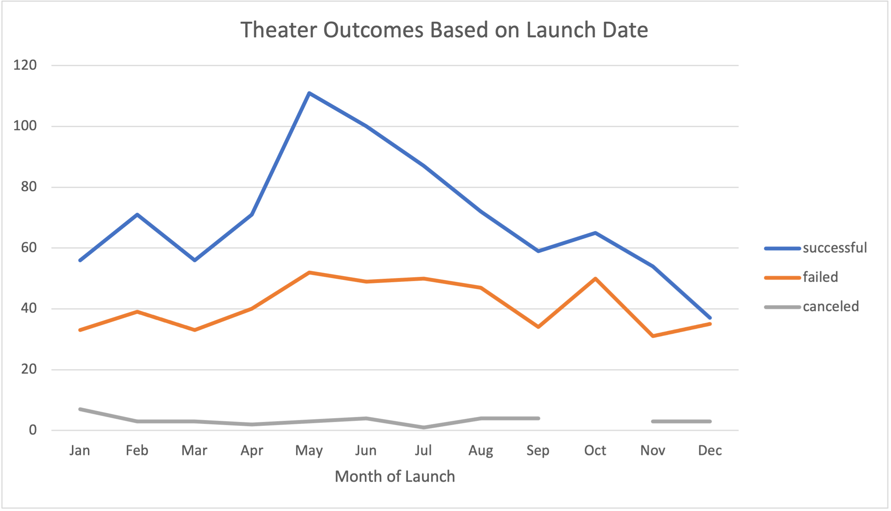
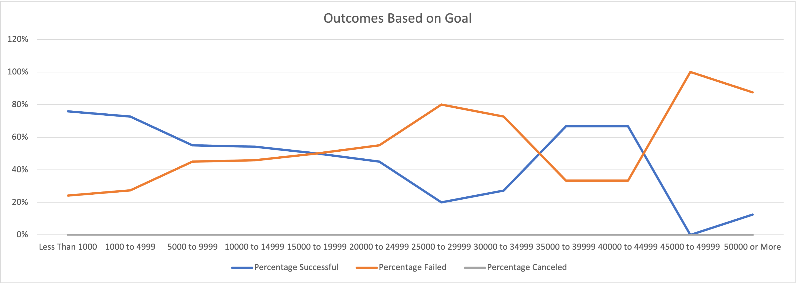

# Kickstarting with Excel

## Overview of Project

### Purpose

The purpose of this project is the examination and visualization of theater campaign outcomes based on their launch dates and their funding goals. Using the results from a Kickstarter data set, the outcomes for campaigns launched by month are presented as well as outcomes for Kickstarter campaigns, specifically plays, by percentage funded within goal ranges. 
--
## Analysis and Challenges

While there were no major challenges with the analysis, there exists opportunities to improve the analysis and provide additional insight to the client. 

### Analysis of Theater Outcomes Based on Launch Date
***Figure 1.***

# Results

- What are two conclusions you can draw about the Outcomes based on Launch Date?

As can be seen above, theater campaigns were most successful between April and August. Interestingly, the number of failed campaigns trended similarly over the same time period, maintaining a relatively constant ratio to successful campaigns over the entire year. It is clear from the chart that the peak for campaigns is during the second quarter of the year. 

### Analysis of Outcomes Based on Funding Goals
***Figure 2.***

# Results
- What can you conclude about the Outcomes based on Goals?

An analysis of theater outcomes, plays specifically, indicate a few major points. More specifically, as the funding goals increases, the likelihood it will be funded decreases. Moreover, campaigns seeking $50,000 or more were more likely to fail. It is important to note that there were no cancelled kickstarter plays, therefore there is limitation to the ability to establish insight on cancelled plays. Finally, as can be seen in the chart, there are points in funding where the likelihood to fail is equal to the likelihood to succeed. It may be at these ranges campaigns have a fair chance at success. 

### Challenges and Difficulties Encountered

There were no challenges and difficulties encountered with this dataset. However, as with most data, the client may benefit from adding an additional year or two of campaign data to reduce the impact of year specific extraneous variables. 

- What are some limitations of this dataset?

The dataset is robust with various types of campaigns but it seems the client is mostly focused on theater. It would be helpful to understand the trends for theater kickstarter campaigns over the last 5 years. Plays are  genre of theater that may not be as successful as another theatrical event. 

- What are some other possible tables and/or graphs that we could create?

#### Other Considerations

There are interesting trends in the data that suggest parameters for goals that result in success for funding. For example, examination of descriptive statistics suggest that failed kickstarters had funding goals, on average, twice as much as successful kickstarter campaigns. It may be also helpful to examine the outcomes against end of campaign date and percentage funding. This may suggest that some campaigns require longer to reach their goal or that some campaigns are most successful within short windows for funding. 
